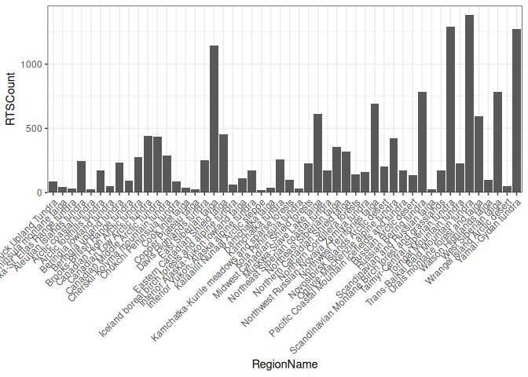
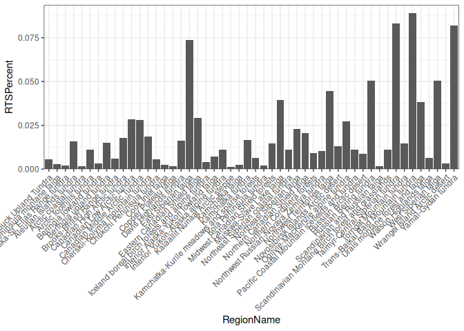
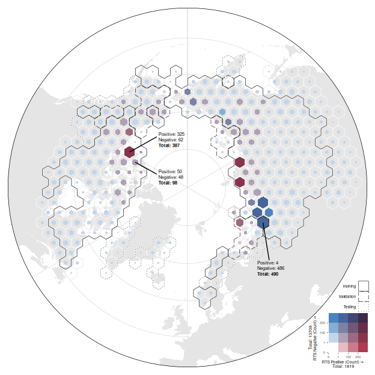

# Training Data Distribution
Heidi Rodenhizer

# Check Training Polygon Counts by Subregion

``` r
region_train_count = train_meta |>
  summarise(
    RTSCount = n(),
    .by = RegionName
  ) |>
  mutate(
    RTSPercent = RTSCount / sum(RTSCount)
  ) |>
  arrange(-RTSPercent)
region_train_count
```

    # A tibble: 50 × 3
       RegionName                        RTSCount RTSPercent
       <chr>                                <int>      <dbl>
     1 Trans-Baikal Bald Mountain tundra     1385     0.0892
     2 Taimyr-Central Siberian tundra        1294     0.0833
     3 Yamal-Gydan tundra                    1270     0.0818
     4 East Siberian taiga                   1145     0.0737
     5 Russian Bering tundra                  784     0.0505
     6 West Siberian taiga                    784     0.0505
     7 Northwest Territories taiga            692     0.0446
     8 Muskwa-Slave Lake taiga                611     0.0393
     9 Urals montane forest and taiga         593     0.0382
    10 Eastern Canadian Shield taiga          455     0.0293
    # ℹ 40 more rows





``` r
small_clusters_percent = region_train_count |>
  filter(RTSPercent < 0.1) |>
  summarise(TotalPercentSmallClusters = sum(RTSPercent))
small_clusters_percent
```

    # A tibble: 1 × 1
      TotalPercentSmallClusters
                          <dbl>
    1                         1

# Map Training Data

## Convert metadata to sf

``` r
train_points = train_meta %>%
  st_as_sf(coords = c("centroid_lon", "centroid_lat"), crs = 4326) %>%
  st_transform(crs = 6931) %>%
  bind_cols(st_coordinates(.)) |>
  mutate(
    RTS = as.integer(case_when(
      TrainClass == "positive" ~ 1,
      TrainClass == "negative" ~ 0
    )),
    NoRTS = as.integer(case_when(
      TrainClass == "positive" ~ 0,
      TrainClass == "negative" ~ 1
    ))
  )

rts_points = train_points |>
  filter(TrainClass == "positive")

neg_points = train_points |>
  filter(TrainClass == "negative")

# train_bboxes = train_points |>
#   st_buffer(dist = 4.77 * 256, endCapStyle = "SQUARE")
```

``` r
# st_write(train_points, "./domain/train_points.geojson")
```

## Create Hex Grid

### Count Scaled Hex

``` r
class_breaks = c(0, 1, 100, 200)

train_hex = train_points |>
  st_make_grid(
    cellsize = sqrt((100000 * 2) / (3 * sqrt(3))) * sqrt(3) * 1000, # get short side length of hexagon from area == 10000 km^2, and convert to m
    square = FALSE
  ) |>
  st_as_sf() |>
  rename(geometry = x) |>
  st_join(train_points, left = FALSE) |>
  summarize(
    Count = n(),
    RTSCount = sum(RTS),
    NoRTSCount = sum(NoRTS),
    .by = c(geometry)
  ) |>
  # bi_class(
  #   x = RTSCount,
  #   y = NoRTSCount,
  #   style = "equal",
  #   dim = 3
  # ) |>
  rowwise() |>
  mutate(
    # bi_class = str_flatten(
    #   map_df(
    #     as_tibble(str_split(bi_class, "-", simplify = TRUE)),
    #     ~ as.numeric(.x) + 1
    #   ),
    #   collapse = "-"
    # )
    bi_class = str_flatten(
      c(
        classify_counts(RTSCount, breaks = class_breaks),
        classify_counts(NoRTSCount, breaks = class_breaks)
      ),
      collapse = "-"
    )
  ) |>
  ungroup() |>
  mutate(
    # bi_class = case_when(
    #   bi_class == "2-2" & RTSCount == 0 & NoRTSCount == 0 ~
    #     "1-1",
    #   bi_class == "2-2" & RTSCount == 0 & NoRTSCount != 0 ~
    #     "1-2",
    #   bi_class == "2-2" & RTSCount != 0 & NoRTSCount == 0 ~
    #     "2-1",
    #   TRUE ~ bi_class
    # ),
    Buffer = (sqrt((100000 * 2) / (3 * sqrt(3))) * sqrt(3) * 1000) /
      2 *
      (0.9 - sqrt(Count / max(Count)) * 0.9), # use this ratio to scale the hexagons by total count: hexagon short side length * percentile of total count
    geometry_scaled = st_buffer(geometry, dist = Buffer * -1) # geometry of scaled hexagons
  ) |>
  st_join(
    subregions |>
      select(-COLOR),
    largest = TRUE
  ) |>
  rename(ecoregion = ECO_NAME)
```

    Warning: attribute variables are assumed to be spatially constant throughout
    all geometries

### Region Hex

``` r
regions_hex = train_hex |>
  left_join(splits_df) |>
  summarise(
    geometry = st_union(geometry),
    .by = c(group)
  ) |>
  mutate(
    geometry_offset = st_buffer(geometry, dist = -5000),
    group = factor(
      case_when(
        str_detect(group, "test") ~ "Testing",
        str_detect(group, "train") ~ "Training",
        str_detect(group, "val") ~ "Validation"
      ),
      levels = c("Training", "Validation", "Testing")
    )
  ) |>
  filter(!is.na(group))
```

    Joining with `by = join_by(ecoregion)`

## Examples for Map Labels

``` r
examples = train_hex |>
  filter(
    RTSCount == max(RTSCount) |
      NoRTSCount == max(NoRTSCount) |
      abs(RTSCount - NoRTSCount) / Count ==
        min(abs(RTSCount - NoRTSCount) / Count)
  ) |>
  mutate(
    geometry_centroid = st_centroid(geometry),
    nudge_x = c(10, 10, 10),
    nudge_y = c(10, 10, 10)
  ) |>
  st_set_geometry("geometry_centroid") |>
  select(Count, RTSCount, NoRTSCount, nudge_x, nudge_y)
examples = examples %>%
  bind_cols(
    st_coordinates(.$geometry_centroid)
  ) |>
  rename(x_start = X, y_start = Y) |>
  mutate(
    x_end = x_start + c(800000, 630000, 180000),
    y_end = y_start + c(450000, -350000, -1100000),
    label = paste0("Positive: ", RTSCount, "\nNegative: ", NoRTSCount),
    label_total = paste0("Total: ", Count)
  )
```

## Map

### Custom palette

``` r
# column 1
reds = colorRampPalette(c("#FFFFFF", "#AE3A4E"))
reds_4 <- reds(4)
# row 1
blues = colorRampPalette(c("#FFFFFF", "#4885C1"))
blues_4 <- blues(4)
# purples = colorRampPalette(c("#FFFFFF", "#3F2949"))
# purples_4 <- purples(4)
# row 4
red_purples = colorRampPalette(c("#AE3A4E", "#3F2949"))
red_purples_4 = red_purples(4)
# column 4
blue_purples = colorRampPalette(c("#4885C1", "#3F2949"))
blue_purples_4 = blue_purples(4)
# column 2 from blues and red_purples
column2s = colorRampPalette(c(blues_4[2], red_purples_4[2]))
column2s_4 <- column2s(4)
# column 3 from blues and red_purples
column3s = colorRampPalette(c(blues_4[3], red_purples_4[3]))
column3s_4 <- column3s(4)


custom_pal4 <- c(
  # must be in this order! Otherwise it gives an error saying that the label formats are incorrect.
  "1-1" = "#FFFFFF", # 0 x, 0 y
  "2-1" = "#E4BDC4", # low x, 0 y
  "3-1" = "#C97B89", # mid x, 0 y
  "4-1" = "#AE3A4E", # high x, 0 y
  "1-2" = "#C2D6EA", # 0 x, low y
  "2-2" = "#AFA0B5", # low x, low y
  "3-2" = "#9C6A80", # mid x, low y
  "4-2" = "#89344C", # high x, low y (does this work?)
  "1-3" = "#85ADD5", # 0 x, mid y
  "2-3" = "#7A82A6", # low x, mid y
  "3-3" = "#6F5878", # mid x, mid y
  "4-3" = "#642E4A", # high x, mid y
  "1-4" = "#4885C1", # 0 x, high y
  "2-4" = "#456699", # low x, high y
  "3-4" = "#424771", # mid x, high y
  "4-4" = "#3F2949" # high x, high y
)
```

### Legend

``` r
total_counts = train_points |>
  st_drop_geometry() |>
  summarise(n = n(), .by = c(TrainClass)) |>
  mutate(
    n = paste("Total:", n),
    x = c(-1.35, 2),
    y = c(2, -0.9),
    angle = c(90, 0)
  )

legend <- bi_legend(
  pal = custom_pal4,
  dim = 4,
  xlab = "RTS Positive (Count)",
  ylab = "RTS Negative (Count)",
  size = 5,
  breaks = list(
    "bi_x" = c(class_breaks, max(train_hex |> pull(RTSCount))),
    "bi_y" = c(class_breaks, max(train_hex |> pull(NoRTSCount)))
  )
) +
  geom_text(
    data = total_counts,
    aes(x = x, y = y, angle = angle, label = n),
    size = 1.85
  ) +
  coord_fixed(
    xlim = c(0.5, 3.5),
    ylim = c(0.5, 3.5),
    clip = "off"
  ) +
  theme(
    plot.margin = margin(6, 5, 6, 10),
    plot.background = element_rect(
      fill = fill_alpha("white", 0)
    )
  )
```

    Coordinate system already present.
    ℹ Adding new coordinate system, which will replace the existing one.

``` r
# legend
```

### Map

``` r
train_hexplot = ggplot(world_north) +
  geom_sf(
    data = long_lines,
    color = 'gray85',
    linewidth = 0.25
  ) +
  geom_sf(
    data = lat_lines,
    color = 'gray85',
    linewidth = 0.25
  ) +
  geom_sf(
    color = 'transparent',
    fill = 'gray90'
  ) +
  geom_sf(
    data = train_hex,
    aes(geometry = geometry),
    fill = "transparent",
    color = "gray95",
    linewidth = 0.5
  ) +
  geom_sf(
    data = train_hex,
    aes(geometry = geometry_scaled, fill = bi_class),
    color = "transparent",
    alpha = 1
  ) +
  bi_scale_fill(
    pal = custom_pal4,
    dim = 4,
    guide = "none"
  ) +
  geom_sf(
    data = regions_hex,
    aes(
      geometry = geometry_offset,
      linetype = group
    ),
    color = "black",
    fill = "transparent"
  ) +
  scale_linetype_manual(
    name = "Training\nGroup",
    # guide = guide_legend(reverse = TRUE),
    values = c("solid", "longdash", "dotted")
  ) +
  geom_segment(
    data = examples,
    aes(x = x_start, xend = x_end, y = y_start, yend = y_end)
  ) +
  geom_text(
    data = examples,
    aes(
      x = x_end + c(50000, 50000, -350000),
      y = y_end + c(0, 0, -150000),
      label = label
    ),
    size = 2,
    hjust = 0,
    lineheight = 1
  ) +
  geom_text(
    data = examples,
    aes(
      x = x_end + c(50000, 50000, -350000),
      y = y_end + c(rep(-250000, 2), -250000 - 150000),
      label = label_total
    ),
    size = 2,
    fontface = "bold",
    hjust = 0,
    lineheight = 1
  ) +
  geom_sf(
    data = crop_poly,
    color = 'black',
    fill = 'transparent',
    linewidth = 0.25
  ) +
  scale_x_continuous(expand = expansion(mult = c(0.01, 0.01))) +
  scale_y_continuous(expand = expansion(mult = c(0.01, 0.01))) +
  coord_sf() +
  theme_void() +
  theme(
    legend.title = element_blank(),
    # legend.title = element_text(size = 5.5),
    legend.text = element_text(size = 5, margin = margin(0, 3, 0, 0)),
    legend.text.position = "left",
    legend.position = "inside",
    legend.position.inside = c(0.995, 0.16),
    legend.justification = c(1, 0),
    legend.key.size = unit(13, "points"),
    legend.key.spacing.x = unit(0, "points")
    # plot.margin = margin(10, 10, 10, 10) # trying to fix the outer circle getting cut off at top, bottom, left, and right
  )

inset_location = c(
  left = 0.62 + 0.18,
  bottom = 0.105 - 0.105,
  right = 0.79 + 0.21,
  top = 0.275 - 0.13
)

train_hexplot = train_hexplot +
  inset_element(
    legend,
    left = inset_location["left"],
    bottom = inset_location["bottom"],
    right = inset_location["right"],
    top = inset_location["top"]
  )
train_hexplot
```



``` r
ggsave(
  "./plots/training_data_map.png",
  train_hexplot,
  height = 6.5,
  width = 6.5
)
```
