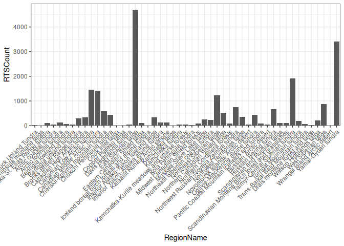
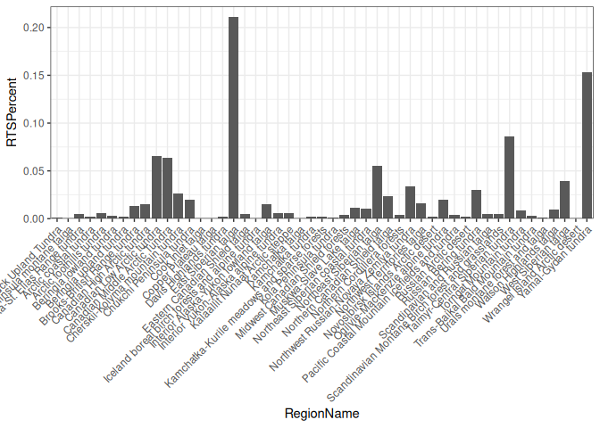
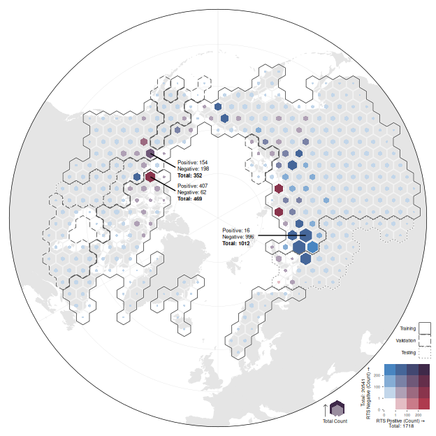

# Training Data Distribution
Heidi Rodenhizer

# Check Training Polygon Counts by Subregion

``` r
region_train_count <- train_meta |>
  summarise(
    RTSCount = n(),
    .by = RegionName
  ) |>
  mutate(
    RTSPercent = RTSCount / sum(RTSCount)
  ) |>
  arrange(-RTSPercent)
region_train_count
```

                                             RegionName RTSCount   RTSPercent
    1                               East Siberian taiga     4705 0.2113751741
    2                                Yamal-Gydan tundra     3400 0.1527472034
    3                    Taimyr-Central Siberian tundra     1913 0.0859427647
    4                        Canadian Low Arctic tundra     1467 0.0659059257
    5                     Canadian Middle Arctic Tundra     1418 0.0637045689
    6                          Northeast Siberian taiga     1235 0.0554831753
    7                               West Siberian taiga      876 0.0393548677
    8            Northwest Russian-Novaya Zemlya tundra      745 0.0334696078
    9                             Russian Bering tundra      679 0.0305045150
    10                  Cherskii-Kolyma mountain tundra      588 0.0264162811
    11                   Northern Canadian Shield taiga      529 0.0237656678
    12                         Chukchi Peninsula tundra      450 0.0202165416
    13                  Ogilvie-MacKenzie alpine tundra      439 0.0197223595
    14                      Northwest Territories taiga      348 0.0156341255
    15              Interior Alaska-Yukon lowland taiga      346 0.0155442742
    16                      Canadian High Arctic tundra      333 0.0149602408
    17                      Brooks-British Range tundra      292 0.0131182892
    18                          Muskwa-Slave Lake taiga      249 0.0111864864
    19                Northeast Siberian coastal tundra      229 0.0102879734
    20                           Watson Highlands taiga      203 0.0091199066
    21                          Torngat Mountain tundra      182 0.0081764679
    22                          Arctic foothills tundra      132 0.0059301855
    23              Interior Yukon-Alaska alpine tundra      128 0.0057504830
    24                   Kalaallit Nunaat Arctic steppe      121 0.0054360034
    25 Scandinavian Montane Birch forest and grasslands      119 0.0053461521
    26                   Scandinavian and Russian taiga      105 0.0047171930
    27                    Eastern Canadian Shield taiga      101 0.0045374905
    28                    Alaska-St. Elias Range tundra       99 0.0044476392
    29    Pacific Coastal Mountain icefields and tundra       90 0.0040433083
    30                      Northern Cordillera forests       86 0.0038636057
    31                  Midwest Canadian Shield forests       82 0.0036839031
    32                          Beringia lowland tundra       60 0.0026955389
    33                Trans-Baikal Bald Mountain tundra       60 0.0026955389
    34                            Russian Arctic desert       55 0.0024709106
    35                           Davis Highlands tundra       53 0.0023810593
    36                                 Kamchatka tundra       50 0.0022462824
    37                Novosibirsk Islands Arctic desert       49 0.0022013568
    38                            Arctic coastal tundra       47 0.0021115055
    39      Kamchatka-Kurile meadows and sparse forests       40 0.0017970259
    40                           Beringia upland tundra       39 0.0017521003
    41                 Ahklun and Kilbuck Upland Tundra       31 0.0013926951
    42                            Kola Peninsula tundra       25 0.0011231412
    43                   Urals montane forest and taiga       17 0.0007637360
    44                   Alaska Peninsula montane taiga        8 0.0003594052
    45                             Copper Plateau taiga        8 0.0003594052
    46   Iceland boreal birch forests and alpine tundra        8 0.0003594052
    47                                  Kamchatka taiga        7 0.0003144795
    48                                 Cook Inlet taiga        7 0.0003144795
    49                     Wrangel Island Arctic desert        6 0.0002695539





``` r
small_clusters_percent <- region_train_count |>
  filter(RTSPercent < 0.1) |>
  summarise(TotalPercentSmallClusters = sum(RTSPercent))
small_clusters_percent
```

      TotalPercentSmallClusters
    1                 0.6358776

# Map Training Data

## Convert metadata to sf

``` r
train_points <- train_meta %>%
  left_join(splits_df, by = c("RegionName" = "ecoregion")) %>%
  st_as_sf(coords = c("centroid_lon", "centroid_lat"), crs = 4326) %>%
  st_transform(crs = 6931) %>%
  bind_cols(st_coordinates(.)) |>
  mutate(
    RTS = as.integer(case_when(
      TrainClass == "positive" ~ 1,
      TrainClass == "negative" ~ 0
    )),
    NoRTS = as.integer(case_when(
      TrainClass == "positive" ~ 0,
      TrainClass == "negative" ~ 1
    ))
  ) |>
  st_as_sf()

rts_points <- train_points |>
  filter(TrainClass == "positive")

neg_points <- train_points |>
  filter(TrainClass == "negative")
```

``` r
# st_write(train_points, "./visualization/data/train_points.geojson", delete_dsn = TRUE)
```

## Create Hex Grid

### Count Scaled Hex

``` r
class_breaks <- c(0, 1, 100, 200)

train_hex <- train_points |>
  st_make_grid(
    cellsize = sqrt((100000 * 2) / (3 * sqrt(3))) * sqrt(3) * 1000, # get short side length of hexagon from area == 10000 km^2, and convert to m
    square = FALSE
  ) |>
  st_as_sf() |>
  rename(geometry = x) |>
  st_join(train_points, left = FALSE) |>
  summarize(
    Count = n(),
    RTSCount = sum(RTS),
    NoRTSCount = sum(NoRTS),
    ecoregion = names(sort(table(RegionName), decreasing = TRUE)[1]),
    .by = c(geometry)
  ) |>
  rowwise() |>
  mutate(
    bi_class = str_flatten(
      c(
        classify_counts(RTSCount, breaks = class_breaks),
        classify_counts(NoRTSCount, breaks = class_breaks)
      ),
      collapse = "-"
    )
  ) |>
  ungroup() |>
  mutate(
    Buffer = (sqrt((100000 * 2) / (3 * sqrt(3))) * sqrt(3) * 1000) /
      2 *
      (0.9 - sqrt(Count / max(Count)) * 0.9), # use this ratio to scale the hexagons by total count: hexagon short side length * percentile of total count
    geometry_scaled = st_buffer(geometry, dist = Buffer * -1) # geometry of scaled hexagons
  )
```

### Region Hex

``` r
regions_hex <- train_hex |>
  left_join(splits_df, by = c("ecoregion")) |>
  summarise(
    geometry = st_union(geometry),
    .by = c(group)
  ) |>
  mutate(
    geometry_offset = st_buffer(geometry, dist = -7000),
    group = factor(
      case_when(
        str_detect(group, "test") ~ "Testing",
        str_detect(group, "train") ~ "Training",
        str_detect(group, "val") ~ "Validation"
      ),
      levels = c("Training", "Validation", "Testing")
    )
  )
```

## Examples for Map Labels

``` r
examples <- train_hex |>
  filter(
    RTSCount == max(RTSCount) |
      NoRTSCount == max(NoRTSCount) |
      RTSCount > 100 & NoRTSCount > 100
  ) |>
  mutate(
    geometry_centroid = st_centroid(geometry),
    nudge_x = c(10, 10, 10),
    nudge_y = c(10, 10, 10)
  ) |>
  st_set_geometry("geometry_centroid") |>
  select(Count, RTSCount, NoRTSCount, nudge_x, nudge_y)
examples <- examples %>%
  bind_cols(
    st_coordinates(.$geometry_centroid)
  ) |>
  rename(x_start = X, y_start = Y) |>
  mutate(
    x_end = x_start + c(630000, 630000, -1200000),
    y_end = y_start + c(-350000, -350000, 0),
    label = paste0("Positive: ", RTSCount, "\nNegative: ", NoRTSCount),
    label_total = paste0("Total: ", Count)
  )
```

## Map

### Custom palette

``` r
# column 1
reds <- colorRampPalette(c("#FFFFFF", "#AE3A4E"))
reds_4 <- reds(4)
# row 1
blues <- colorRampPalette(c("#FFFFFF", "#4885C1"))
blues_4 <- blues(4)
# purples = colorRampPalette(c("#FFFFFF", "#3F2949"))
# purples_4 <- purples(4)
# row 4
red_purples <- colorRampPalette(c("#AE3A4E", "#3F2949"))
red_purples_4 <- red_purples(4)
# column 4
blue_purples <- colorRampPalette(c("#4885C1", "#3F2949"))
blue_purples_4 <- blue_purples(4)
# column 2 from blues and red_purples
column2s <- colorRampPalette(c(blues_4[2], red_purples_4[2]))
column2s_4 <- column2s(4)
# column 3 from blues and red_purples
column3s <- colorRampPalette(c(blues_4[3], red_purples_4[3]))
column3s_4 <- column3s(4)


custom_pal4 <- c(
  # must be in this order! Otherwise it gives an error saying that the label formats are incorrect.
  "1-1" = "#FFFFFF", # 0 x, 0 y
  "2-1" = "#E4BDC4", # low x, 0 y
  "3-1" = "#C97B89", # mid x, 0 y
  "4-1" = "#AE3A4E", # high x, 0 y
  "1-2" = "#C2D6EA", # 0 x, low y
  "2-2" = "#AFA0B5", # low x, low y
  "3-2" = "#9C6A80", # mid x, low y
  "4-2" = "#89344C", # high x, low y (does this work?)
  "1-3" = "#85ADD5", # 0 x, mid y
  "2-3" = "#7A82A6", # low x, mid y
  "3-3" = "#6F5878", # mid x, mid y
  "4-3" = "#642E4A", # high x, mid y
  "1-4" = "#4885C1", # 0 x, high y
  "2-4" = "#456699", # low x, high y
  "3-4" = "#424771", # mid x, high y
  "4-4" = "#3F2949" # high x, high y
)
```

### Bivariate Legend

``` r
total_counts <- train_points |>
  st_drop_geometry() |>
  summarise(n = n(), .by = c(TrainClass)) |>
  mutate(
    n = paste("Total:", n),
    x = c(2, -1.35),
    y = c(-0.9, 2),
    angle = c(0, 90)
  )

bi_legend <- bi_legend(
  pal = custom_pal4,
  dim = 4,
  xlab = "RTS Positive (Count)",
  ylab = "RTS Negative (Count)",
  size = 5,
  breaks = list(
    "bi_x" = c(class_breaks, max(train_hex |> pull(RTSCount))),
    "bi_y" = c(class_breaks, max(train_hex |> pull(NoRTSCount)))
  )
) +
  geom_text(
    data = total_counts,
    aes(x = x, y = y, angle = angle, label = n),
    size = 1.85
  ) +
  coord_fixed(
    xlim = c(0.5, 3.5),
    ylim = c(0.5, 3.5),
    clip = "off"
  ) +
  theme(
    plot.margin = margin(6, 5, 6, 10),
    plot.background = element_rect(
      fill = fill_alpha("white", 0)
    )
  )
```

    Coordinate system already present.
    ℹ Adding new coordinate system, which will replace the existing one.

``` r
# bi_legend
```

### Size Legend

``` r
hex_legend_data <- train_hex |>
  slice(rep(1, 3))
bounds <- st_bbox(hex_legend_data$geometry)
hex_legend_data <- hex_legend_data |>
  mutate(
    geometry = geometry - c(bounds$xmin, bounds$ymin),
    Count = c(
      max(train_hex$Count),
      (max(train_hex$Count) - 1) * 0.5 + 1,
      1
    ),
    Buffer = (sqrt((100000 * 2) / (3 * sqrt(3))) * sqrt(3) * 1000) /
      2 *
      (0.9 - sqrt(Count / max(Count)) * 0.9), # use this ratio to scale the hexagons by total count: hexagon short side length * percentile of total count
    geometry_scaled = st_buffer(geometry, dist = Buffer * -1) # geometry of scaled hexagons
  ) |>
  rowwise() |>
  mutate(
    geometry_scaled = geometry_scaled - c(0, st_bbox(geometry_scaled)$ymin)
  )

arrow <- tibble(
  x = 0 - 100000,
  y = 0 + 15000,
  xend = 0 - 100000,
  yend = st_bbox(hex_legend_data)["ymax"] - 100000
)

size_legend <- ggplot() +
  geom_sf(
    data = hex_legend_data,
    aes(
      geometry = geometry_scaled,
      fill = Count
    ),
    color = "transparent"
  ) +
  scale_fill_gradient(
    low = "white",
    high = "#3F2949"
  ) +
  geom_segment(
    data = arrow,
    aes(
      x = x,
      y = y,
      xend = xend,
      yend = yend
    ),
    arrow = arrow(length = unit(3, "points"), angle = 45),
    linewidth = 0.2
  ) +
  geom_text(
    aes(
      x = st_bbox(hex_legend_data)["xmax"] -
        (st_bbox(hex_legend_data)["xmax"] - arrow$x) / 2,
      y = arrow$y - 100000,
      label = "Total Count"
    ),
    hjust = 0.5,
    size = 1.75,
    # angle = 90
  ) +
  coord_sf(clip = "off") +
  theme_void() +
  theme(
    legend.position = "none"
  )
# size_legend
```

### Map

``` r
train_hexplot <- ggplot(world_north) +
  geom_sf(
    data = long_lines,
    color = 'gray85',
    linewidth = 0.25
  ) +
  geom_sf(
    data = lat_lines,
    color = 'gray85',
    linewidth = 0.25
  ) +
  geom_sf(
    color = 'transparent',
    fill = 'gray90'
  ) +
  geom_sf(
    data = train_hex,
    aes(geometry = geometry_scaled, fill = bi_class),
    color = "transparent",
    alpha = 1
  ) +
  geom_sf(
    data = train_hex,
    aes(geometry = geometry),
    fill = "transparent",
    color = "gray95",
    linewidth = 0.5
  ) +
  bi_scale_fill(
    pal = custom_pal4,
    dim = 4,
    guide = "none"
  ) +
  geom_sf(
    data = regions_hex,
    aes(
      geometry = geometry_offset,
      linetype = group
    ),
    color = "black",
    fill = "transparent"
  ) +
  scale_linetype_manual(
    name = "Training\nGroup",
    values = c("solid", "longdash", "dotted")
  ) +
  geom_segment(
    data = examples,
    aes(x = x_start, xend = x_end, y = y_start, yend = y_end),
    linewidth = 0.5
  ) +
  geom_text(
    data = examples,
    aes(
      x = x_end + c(50000, 50000, -900000),
      y = y_end + c(50000, 50000, 50000),
      label = label
    ),
    size = 2,
    hjust = 0,
    lineheight = 1
  ) +
  geom_text(
    data = examples,
    aes(
      x = x_end + c(50000, 50000, -900000),
      y = y_end + c(-200000, -200000, -200000),
      label = label_total
    ),
    size = 2,
    fontface = "bold",
    hjust = 0,
    lineheight = 1
  ) +
  geom_sf(
    data = crop_poly,
    color = 'black',
    fill = 'transparent',
    linewidth = 0.25
  ) +
  scale_x_continuous(expand = expansion(mult = c(0.01, 0.01))) +
  scale_y_continuous(expand = expansion(mult = c(0.01, 0.01))) +
  coord_sf() +
  theme_void() +
  theme(
    legend.title = element_blank(),
    legend.text = element_text(size = 5, margin = margin(0, 3, 0, 0)),
    legend.text.position = "left",
    legend.position = "inside",
    legend.position.inside = c(1, 0.17),
    legend.justification = c(1, 0),
    legend.key.size = unit(13, "points"),
    legend.key.spacing.x = unit(0, "points")
  )

bi_legend_location <- c(
  left = 0.81,
  bottom = 0,
  right = 1,
  top = 0.145
)

size_legend_location <- c(
  left = 0.75,
  bottom = 0.02,
  right = 0.8,
  top = 0.075
)

train_hexplot <- train_hexplot +
  inset_element(
    bi_legend,
    left = bi_legend_location["left"],
    bottom = bi_legend_location["bottom"],
    right = bi_legend_location["right"],
    top = bi_legend_location["top"]
  ) +
  inset_element(
    size_legend,
    left = size_legend_location["left"],
    bottom = size_legend_location["bottom"],
    right = size_legend_location["right"],
    top = size_legend_location["top"]
  )
train_hexplot
```



``` r
ggsave(
  "./plots/training_data_map.png",
  train_hexplot,
  height = 6.5,
  width = 6.5
)
```
